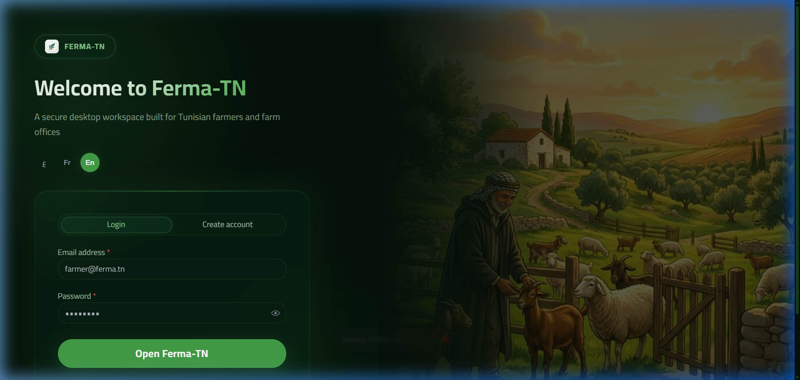

# Farming Tunisia Workspace

Desktop farming management application for Tunisian farmers, split into a Fastify backend and an Electron desktop client



## Structure

```text
backend/         Fastify API, MongoDB access, JWT auth, farm modules
desktop-client/  Electron main process, preload bridge, React dashboard UI
docs/            UI decision notes
Makefile         Install, typecheck, build, and run shortcuts
```

## Tech choices

- Backend: Fastify + TypeScript + MongoDB Atlas + JWT
- Desktop: Electron + React + Mantine + React Query + i18n
- Languages: Arabic, French, English
- Design direction: Tunisian agriculture friendly dashboard with RTL support

## Environment

The repo-level `.env` is shared by both apps.

```env
MONGO_URL=your-mongodb-atlas-uri
JWT_SECRET=strong-secret-for-access-tokens
APP_NAME=Namaa Farm Desk
API_HOST=127.0.0.1
API_PORT=4545
API_BASE_URL=http://127.0.0.1:4545
```

## Commands

```bash
make install
make typecheck
make build
make dev
```

## Notes

- `make dev` runs the backend and desktop client together.
- The desktop app expects the backend on `API_BASE_URL` and defaults to `http://127.0.0.1:4545`.
- Keep `.env` out of version control because it contains secrets.
